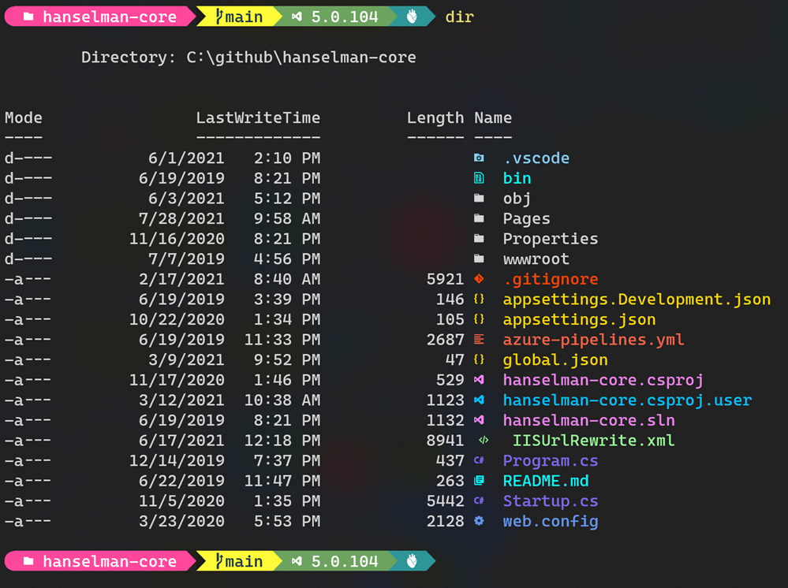

# System Settings

1. Check Windows Updates
1. [Activate Developer Mode and developer settings](https://docs.microsoft.com/en-gb/windows/apps/get-started/enable-your-device-for-development?OCID=WinClient_Ver1703_Settings_DevMode), such as showing hidden files, file extensions, PowerShell execution policy etc.

# Enable Windows Optional Features

* IIS
* Containers
* Hyper-V
* Windows-Subsystem-Linux

Run [SetupIIS.ps1](https://github.com/darkato42/system-init/blob/main/windows/SetupIIS.ps1) and [SetupOtherWinFeatures](https://github.com/darkato42/system-init/blob/main/windows/SetupOtherWinFeatures.ps1) with Admin PowerShell:

```powershell
# iex is an alias for Invoke-Expression

# Install IIS
iex ((New-Object System.Net.WebClient).DownloadString('https://raw.githubusercontent.com/darkato42/system-init/main/windows/SetupIIS.ps1'))
# Install Containers, Hyper-V and Windows-Subsystem-Linux
iex ((New-Object System.Net.WebClient).DownloadString('https://raw.githubusercontent.com/darkato42/system-init/main/windows/SetupOtherWinFeatures.ps1'))
```

# Install Fonts

Download from:
https://github.com/ryanoasis/nerd-fonts/tree/master/patched-fonts/CascadiaCode/Regular/complete

Drag `.ttf` files into Font settings in Systems settings. This allows the Windows Terminal to show fancy fonts and icons.



# Install Utility Tools

The preferred order of installation methods:
[winget-cli](https://github.com/microsoft/winget-cli) > [chocolatey](https://github.com/chocolatey/choco) > others

* Chocolatey
* Git
* TortoiseGit
* [AutoHotKey](https://www.autohotkey.com/)
* Microsoft.AzureCLI
* Microsoft.GitCredentialManagerCore
* Microsoft.VisualStudioCode
* Microsoft.dotnet
* Microsoft.PowerShell
* Microsoft.WindowsTerminal
* OhMyPosh
* 7zip
* [Greenshot](https://github.com/greenshot/greenshot)
* Postman
* Fiddler
* NodeJS
* [CapsLock Enhancement](https://github.com/darkato42/Capslock/tree/master/win)

Run [InstallTools.ps1](https://github.com/darkato42/system-init/blob/main/windows/InstallTools.ps1) with Admin PowerShell:

```powershell
# iex is an alias for Invoke-Expression
iex ((New-Object System.Net.WebClient).DownloadString('https://raw.githubusercontent.com/darkato42/system-init/main/windows/InstallTools.ps1'))
```

# Quick Commands

```
# Check PowerShell Version
$PSVersionTable

# Replace $PROFILE
Invoke-WebRequest -Uri 'https://raw.githubusercontent.com/darkato42/system-init/main/windows/Microsoft.PowerShell_profile.ps1' -OutFile $PROFILE

# Install Azure CLI DevOps extension
az extension add --name azure-devops
```

# References

[Hanselman's Posh Win Terminal](https://www.hanselman.com/blog/my-ultimate-powershell-prompt-with-oh-my-posh-and-the-windows-terminal)
[Hanselman's 2021 Ultimate List via WinGet](https://dvlup.com/2020/12/29/2021-ultimate-list/)
